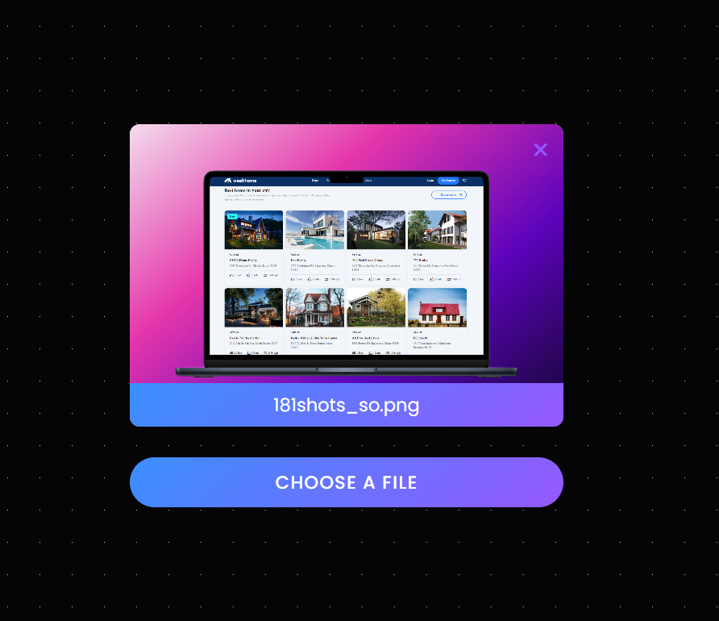

# Preview Image Before Upload

This project is part of a series of small JavaScript projects aimed at enhancing my front-end development skills. This project features a **Preview Image Before Upload** functionality built using **HTML**, **CSS**, and **JavaScript**.

## Features

- **Preview Selected Image:** Allows the user to preview the selected image before uploading.
- **Cancel Preview:** Provides an option to cancel the preview and reset the image.
- **Display File Name:** Shows the name of the selected file to the user.

## How to Use

1. **Choose a File:** Click on the "Choose a file" button to select an image from your device.
2. **Preview Image:** The selected image will be displayed in the preview area.
3. **Cancel Preview:** Click the cancel button to remove the displayed image and reset the preview.

## Screenshot

Preview Image Before Upload
## Technologies Used

- **HTML:** For structuring the web page and including the preview elements.
- **CSS:** For styling and formatting the user interface.
- **JavaScript:** For handling file selection, displaying the image, and canceling the preview.

## Key Files

- **`index.html`**: HTML file containing the structure of the page and preview elements.
- **`style.css`**: CSS file for styling the page.
- **`app.js`**: JavaScript file for handling file selection and image preview functionality.
